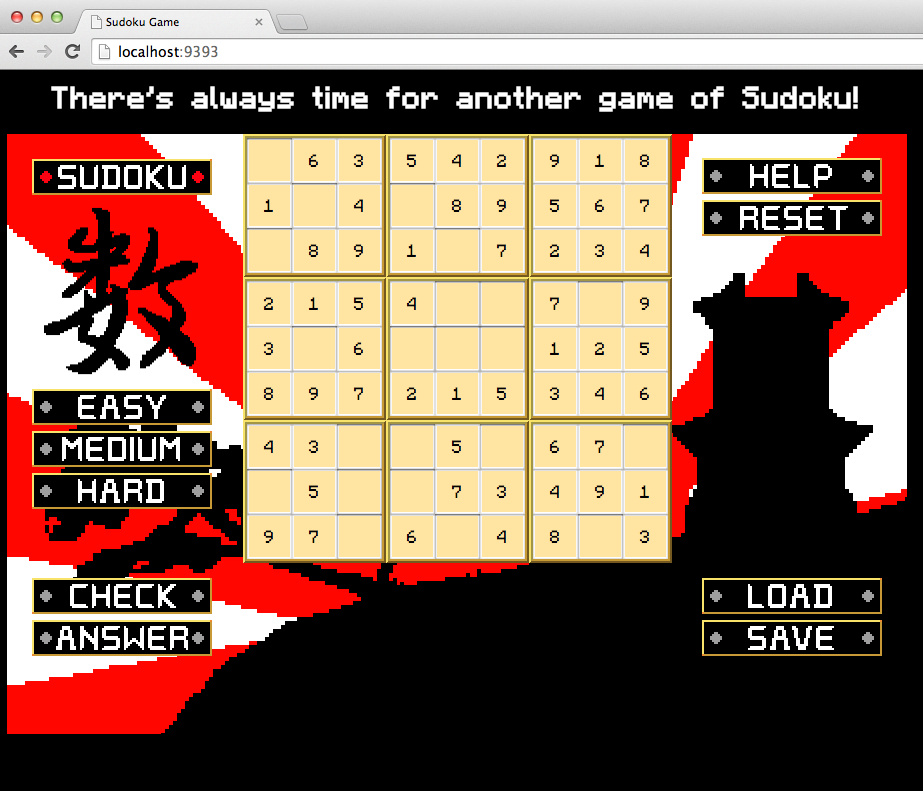

Sudoku-Web-Version
==================
A web version of Sudoku during Week 6 at Makers Academy, London.


Heroku
----
[App on Heroku]

Objectives of exercise
----
Basic math logic, Object-oriented-programming

Technologies used
----
- Ruby
- Sinatra
- HTML5
- CSS3
- Git
- Heroku
- New Relic

How to run it
----
````sh
git clone git@github.com:apostoiis/Sudoku-Web-Version.git
cd Sudoku-Web-Version
shotgun sudoku.rb
```
Pairing Partners
---
[NicoSa], [Rob]

[NicoSa]:https://github.com/NicoSa
[Rob]:https://github.com/RobertAlexanderLeon
[App on Heroku]:http://ran-sudoku-web-heroku-test.heroku.com